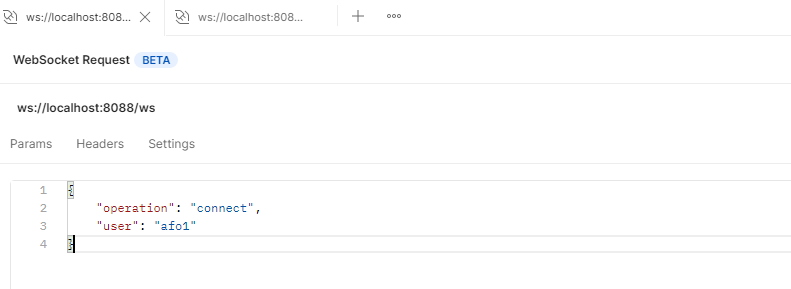
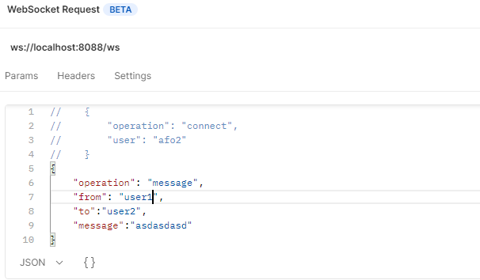
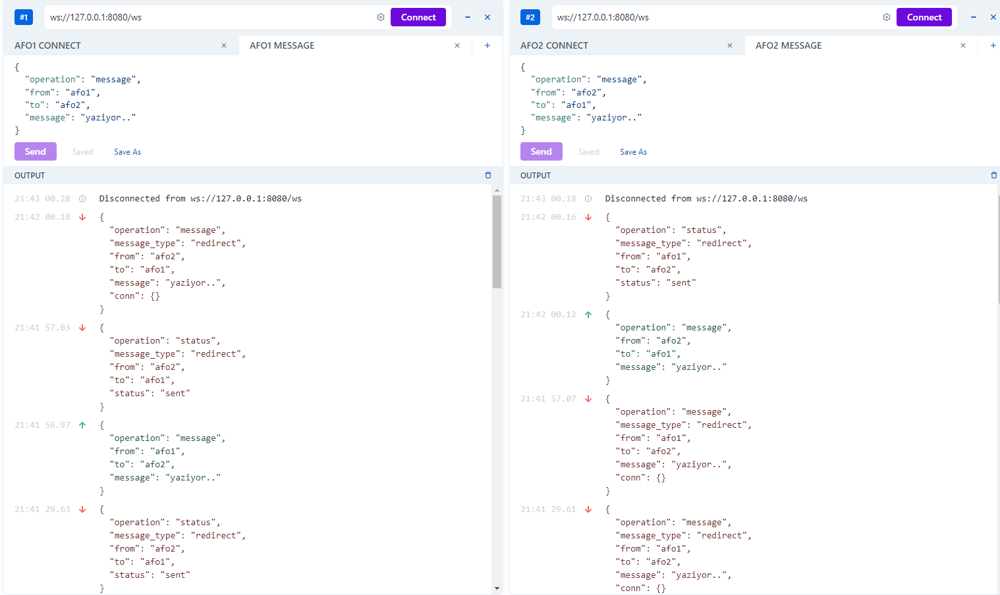

# Go Real Time WebSocket with Goroutine

Real Time Messaging (One to One) Goroutine and channel is used.


# Multiple Instance Design
User information should write to redis with machine information.

# How it's Work

1.) Message come to server (a pod)

2.) First looking for target user in local server.
### if Found on local server
3.) Send Message direcly
### if Not Found
3.) Take target user's machine information from redis with username key.

4.) Publish message to machine information channel using redis.

5.) Each pods RedisReader listening for coming messages and converting it to model.

6.) Send Model to Pool back for finding user and sending message.


---
## Deploy

### Redis

```
docker run --name some-redis -p 6379:6379 -d redis
```
### Docker Compose
```
docker-compose up
```
<br/>



<br/>




Check Simple Messaging with go without goroutine [go_socket_v0.1](https://github.com/FurkanOzkaya/go_socket_v0.1)

Check Simple Messaging with go and goroutine [go_socket_v1.0](https://github.com/FurkanOzkaya/go_socket_v1.0)




